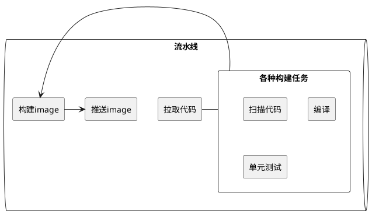
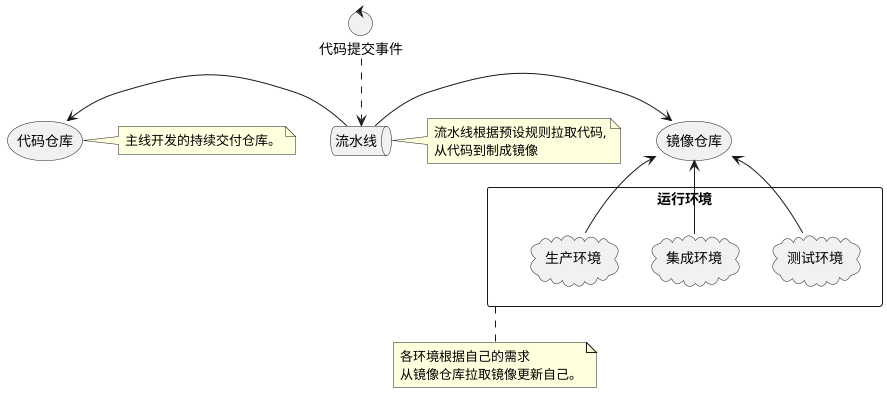

```plantuml
@startuml
queue q as "流水线" {
    rectangle build as "各种构建任务"{
        rectangle s as "扫描代码"
        rectangle c as "编译"
        rectangle ut as "单元测试"
    }
rectangle l as "拉取代码"
rectangle i as "构建image"
rectangle p as "推送image"


}
build - l
build -> i
i ->  p
@enduml
```

```plantuml
@startuml
together {
control ti as "代码提交事件"
queue q as "流水线" 
storage git as "代码仓库"
storage i as "镜像仓库"
}

rectangle a as "运行环境"{
cloud t as "测试环境"
cloud in as "集成环境"
cloud p as "生产环境"

}
ti .down.> q
git <- q
q -> i
t -up-> i
in -up-> i
p -up-> i

note as nr 
    主线开发的持续交付仓库。
end note

note as n
    各环境根据自己的需求
    从镜像仓库拉取镜像更新自己。
end note

note as n2
    流水线根据预设规则拉取代码,
    从代码到制成镜像
end note

n .up. a
n2 .left. q
nr .left. git
@enduml
```